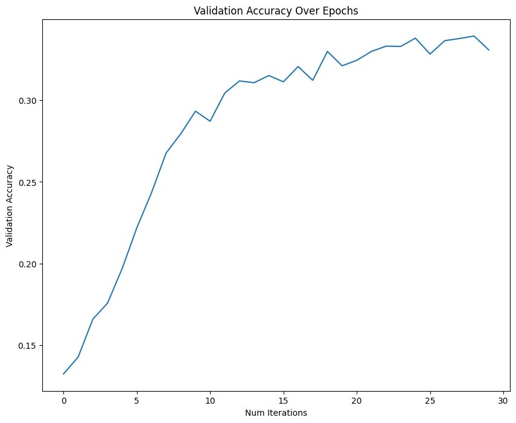

## Introduction and Background
Our Data Set: https://huggingface.co/datasets/DavidVivancos/MindBigData2022

Interpreting brain signals as responses to visual stimuli is an exciting topic of research, with a wide variety of applications in healthcare [1], education [2], and entertainment [3]. These signals can be easily obtained using electroencephalograms (EEG), which employ signal processing techniques like Fourier transforms and spectral analysis to generate meaningful interpretations [4]. Numerical digits are commonly chosen as stimuli in this research because they are discrete, limited in number (0-9), and universally understood [5, 6].

Our data set was developed by David Vivancos, who used 4 different EEG machines to track activity in 19 sections of his own brain upon being shown an image of a single digit at a time. These images ranged from 0-9, or no digit as a control. EEG machines obtain data by placing electrodes, known as “channels,” on different brain regions and recording voltage fluctuations as a time series over a 2-second time interval. Depending on the machine, between 256 and 1024 data samples will be taken simultaneously at each channel during this time period.

The dataset includes 4 main sub-datasets for each EEG machine used. For each subset, there exists a “digit” feature corresponding to the digit shown, an “event id” to catalog unique number-showing events, a “brain region” to map the location from where an electrode made its reading. Finally, there are 256-1024 columns of time series data sampled that correspond to the amplitudes of electric intensities measured from the given “brain region”.

For each “event,” there will be one row of time-series data corresponding to each electrode channel. Therefore, for our purposes, a datapoint can be considered all rows which share the same “event id” -- 19 for the full data set.

For this report, we have elected to focus on two EEG machines for a preliminary understanding of the problem space -- the Emotiv Insight machine and MUSE machine. These machines collect 256 data samples at each electrode channel over the 2-second time interval, corresponding to a frequency of 128 Hz. This data collection happens simultaneously at 5 electrode channels for the Inisght machine (4 for MUSE), so each “event id” will correspond to 5 rows of time-series data. Future development will extend the model from the Insight and MUSE machines to the other EEG machines.

## Problem Definition
We seek to develop an accurate system of decoding brain signals associated with specific visual stimuli, in this case related to numerical digits. Each digit is expected to generate unique amplitudes and intensity patterns in each electrode channel, so a machine learning model can be developed to predict the digit seen based on this time-series data. Through our model, it will be possible to predict what digit is being seen by the candidate given their brain activity.

This research will be applicable in proving the feasibility of brain-computer interfaces (BCI’s), which have immense potential for improving quality of life for individuals experiencing disabilities in physical or verbal communication. Brain-computer interfaces operate by translating electrical signals from the brain into commands that can be applied to a computer or other device [3]. As a result, when methods such as typing, speaking, or gesture-based systems are inaccessible, BCIs that solely rely on brain activity could minimize this accessibility gap.

## Methods
Previously, we preprocessed the data by reducing each time series to its core summary statistics, max, min, mean, and range since data points can be characterized as all rows that share an “event id”. We then trained Logistic Regression, Random Forest, and Gradient Boosting supervised learning models on the preprocessed data.

However we took a vastly different approach this time as all models with varying amounts of hyperparameter tuning were essentially guessing. We switched Logistic Regression with a Convolutional Neural Network where we used the raw data since it handles time-series well. For the CNN, we took the raw data, standardized it for the neural network, and imputed the missing values with column means. 

However for the Random Forest and Gradient Boosting models, we kept the critical statistics but also added in the expanded data set which has approximately 2 times as many data points across 4 different brain regions. This was also standardized, and for Random Forest, performance was boosted after using a PCA to reduce the number of components.

## Results and Discussion

### Recurrent Neural Network (RNN):
Accuracy Score: 11.13%, F1 Score: 9.91%

### Gradient Boosting:
Accuracy Score: 31.50%, F1 Score: 27.45%

### Random Forest:
Accuracy: 31.01%, F1 Score: 27.73%

### Convolutional Neural Network (CNN):
Accuracy Score: 34.00%, F1 Score: 33.06%

*Analysis and Comparison of Models*

Our new iteration compared Recurrent Neural Network, Gradient Boosting, Random Forest, and CNN models to decode EEG signals. The Recurrent Neural Network performed the worst, essentially guessing the same random number 100% of the time. This was not expected, as the strength of an RNN is to handle time series data. However, there are many facets that could be tapped into, such as tuning the hyperparameters and training the model with more layers. Gradient Boosting provided valuable insights into feature importance but lacked specificity for handling time-series EEG data. Random Forest, while efficient, produced poor true accuracy and F1 scores, making it unsuitable for our application despite enhancements like PCA. This is because we failed to consider the heavy class imbalance associated with the expanded data set and, thus, our model "learned" only to predict based on the imbalance. The CNN’s success underscores its suitability for time-series EEG data, particularly in identifying patterns across multiple electrode channels. However, the increased complexity required significant processing power, which limited our ability to test on larger datasets. While Gradient Boosting and Random Forest offered value in terms of interpretability and efficiency, their limitations in modeling temporal dependencies emphasize the need for tailored approaches like CNNs when dealing with sequential data. These findings validate the potential of neural networks for EEG-based classification tasks, paving the way for further exploration in brain-computer interface development.

*Next Steps*

Our models, while much improved, were still limited by the processing power we had available. For example, we were unable to test them on larger datasets because of the amount of time and energy it would consume on our personal computers. For example, the CNN and RNN took about 1 minute per epoch on the smallest data set and would take about 5 minutes on the larger data sets. Additionally, we suspect that training on the larger data set would assauge the overfitting that occurs for the CNN. For the future, resources like Google Colab would allow us to obtain access to more powerful GPUs for further exploration of this problem space.

Additionally, the Random Forest model was limited by the overly simplified representation of EEG signals and failure to consider class imbalance. Reducing each time series to basic summary statistics (max, min, mean, range) likely discarded essential temporal information, which is crucial in brainwave analysis.

In the future, we plan to make several enhancements. First, we will incorporate Fourier Transforms to shift EEG data into the frequency domain, allowing us to capture patterns in specific frequency bands associated with cognitive states. By applying PCA on these Fourier-transformed features, we hope to retain important patterns while reducing dimensionality. Additionally, we plan to explore Long Short-Term Memory networks (LSTMs) as they are better-equipped for time-series data and can capture sequential dependencies, whereas logistic regression and random forest are used for independent data points.

## Gantt Chart:

## Contribution Chart:

## References:

[1] X. Chai, T. Cao, Q. He, N. Wang, X. Zhang, X. Shan, Z. Lv, W. Tu, Y. Yang, and J. Zhao, "Brain-computer interface digital prescription for neurological disorders," CNS Neuroscience & Therapeutics, vol. 30, no. 2, pp. e14615, Feb. 2024. doi: 10.1111/cns.14615. PMID: 38358054; PMCID: PMC10867871.

[2] P.-C. Hu and P.-C. Kuo, "Adaptive learning system for e-learning based on EEG brain signals," in 2017 IEEE 6th Global Conference on Consumer Electronics (GCCE), Nagoya, Japan, 2017, pp. 1-2, doi: 10.1109/GCCE.2017.8229382.

[3] D. de Queiroz Cavalcanti, F. Melo, T. Silva, M. Falcão, M. Cavalcanti, and V. Becker, "Research on brain-computer interfaces in the entertainment field," in Human-Computer Interaction, M. Kurosu and A. Hashizume, Eds. Cham, Switzerland: Springer, 2023, vol. 14011, pp. 1-10. doi: 10.1007/978-3-031-35596-7_26.

[4] M. Sokač, L. Mršić, M. Balković, and M. Brkljačić, “Bridging Artificial Intelligence and Neurological Signals (brains): A novel framework for electroencephalogram-based image generation,” Information, vol. 15, no. 7, p. 405, Jul. 2024. doi: 10.3390/info15070405.

[5] S. Tiwari, S. Goel, and A. Bhardwaj, "EEG Signals to Digit Classification Using Deep Learning-Based One-Dimensional Convolutional Neural Network," Arabian Journal for Science and Engineering, vol. 48, pp. 9675–9691, 2023, doi: 10.1007/s13369-022-07313-3.

[6] N. C. Mahapatra and P. Bhuyan, "EEG-based classification of imagined digits using a recurrent neural network," Journal of Neural Engineering, vol. 20, no. 2, p. 026040, Apr. 2023, doi: 10.1088/1741-2552/acc976.

[7] Ibm. (2024, August 23). What is Random Forest?. IBM. https://www.ibm.com/topics/random-forest. 

[8] What is XGBoost?. NVIDIA Data Science Glossary. (n.d.). https://www.nvidia.com/en-us/glossary/xgboost/ 

[9] GeeksforGeeks. (2023, January 30). Support vector regression (SVR) using linear and non-linear kernels in Scikit learn. https://www.geeksforgeeks.org/support-vector-regression-svr-using-linear-and-non-linear-kernels-in-scikit-learn/ 
